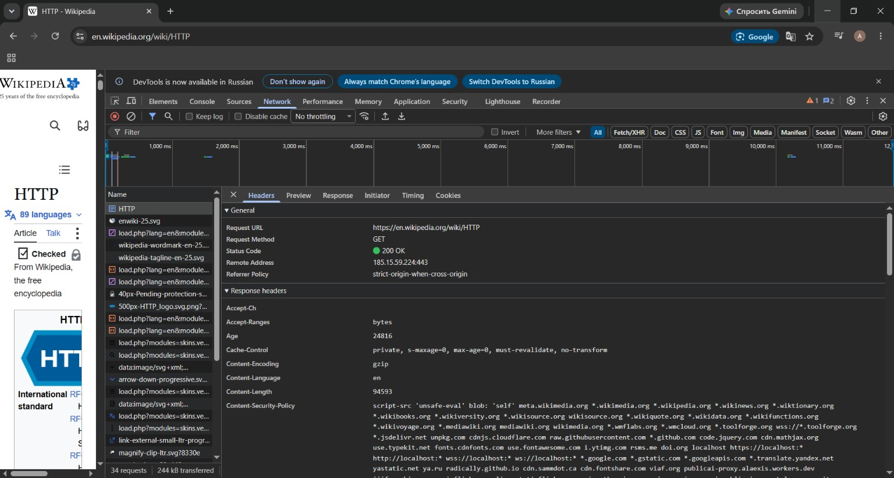
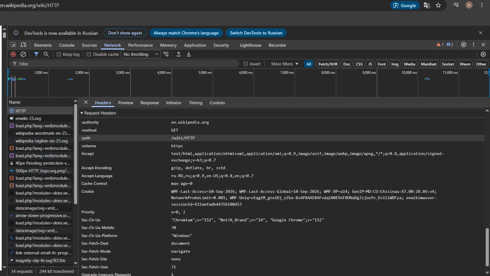
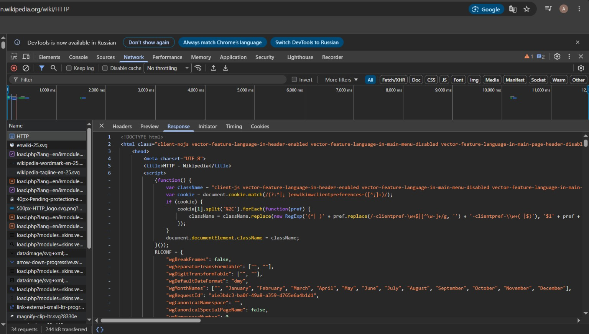
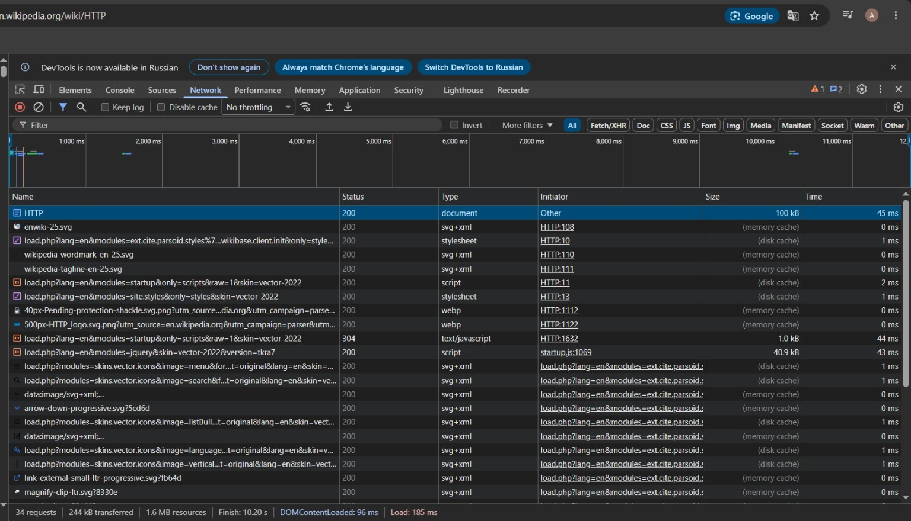
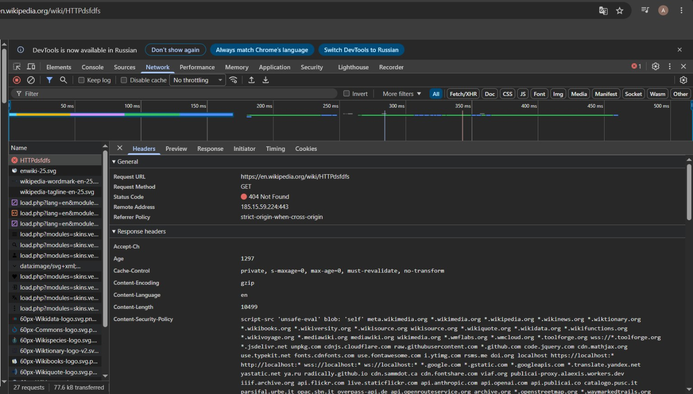
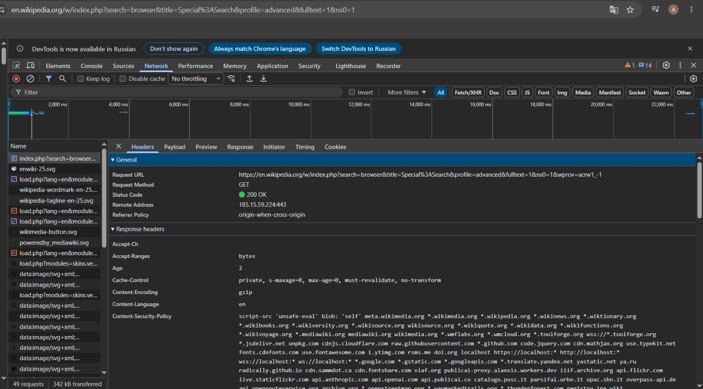
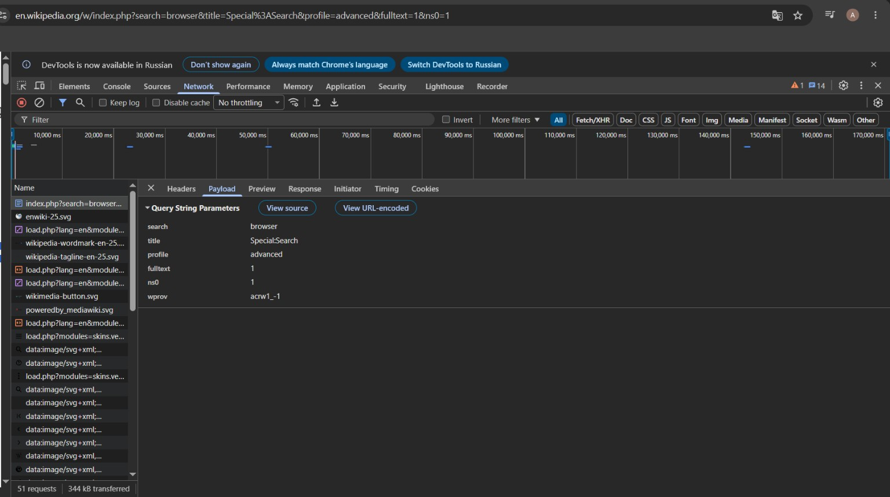
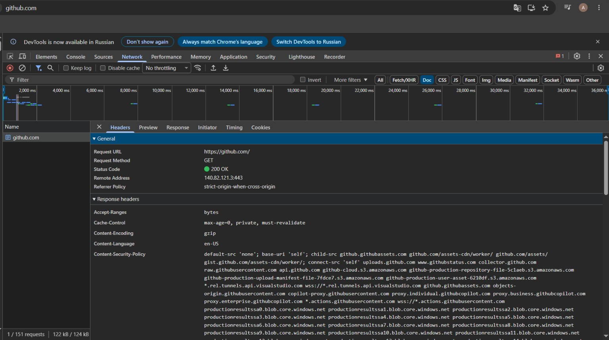

# Лабораторная работа №1. HTTP

**Дисциплина:** Advanced Web Development (PHP)  
**Студент:** Rotari Artemii  
**Группа:** I2502(RU)

## Цель работы

Цель работы состоит в том, чтобы посмотреть, как HTTP работает на практике. Для этого я использовал вкладку `Network` в инструментах разработчика браузера, проанализировал реальные запросы и ответы, а затем составил несколько HTTP-запросов вручную.

---

## Задание 1. Анализ HTTP-запросов. Часть 1

### 1.1. Основная страница Wikipedia

Для анализа была открыта страница:

`https://en.wikipedia.org/wiki/HTTP`

После открытия вкладки `Network` я обновил страницу и выбрал основной запрос `HTTP`, который имеет тип `document`.

| Параметр | Значение |
|---|---|
| Request URL | `https://en.wikipedia.org/wiki/HTTP` |
| Request Method | `GET` |
| Status Code | `200 OK` |
| Remote Address | `185.15.59.224:443` |
| Referrer Policy | `strict-origin-when-cross-origin` |

Для загрузки страницы используется метод `GET`, потому что браузер запрашивает уже существующий ресурс и получает его содержимое. При обычном открытии страницы данные на сервере не изменяются.

Статус `200 OK` означает, что сервер успешно обработал запрос и вернул страницу клиенту.

#### Заголовки запроса

В запросе присутствует большое количество заголовков, но для анализа я выделил несколько основных:

- `Accept` показывает, какие типы содержимого браузер готов принять. В запросе указаны HTML, XHTML, XML, изображения и другие форматы.
- `Accept-Encoding: gzip, deflate, br, zstd` показывает поддерживаемые браузером способы сжатия ответа.
- `Accept-Language: ru-RU,ru;q=0.9,en-US;q=0.8,en;q=0.7` задаёт предпочитаемые языки ответа.
- `User-Agent` содержит информацию о браузере и операционной системе клиента.
- `:authority: en.wikipedia.org` указывает сервер.
- `:method: GET` содержит используемый HTTP-метод.
- `:path: /wiki/HTTP` указывает путь к ресурсу.
- `:scheme: https` показывает, что используется HTTPS.

#### Заголовки ответа

Из заголовков ответа я обратил внимание на следующие:

- `Content-Type: text/html; charset=UTF-8` показывает, что сервер вернул HTML-документ в кодировке UTF-8.
- `Content-Encoding: gzip` означает, что ответ был передан в сжатом виде.
- `Content-Language: en` указывает язык содержимого страницы.
- `Content-Length: 94593` показывает размер тела ответа в байтах.
- `Cache-Control` содержит правила кэширования ответа.

Тело запроса отсутствует. Для обычного `GET`-запроса страницы браузеру не требуется передавать данные серверу в теле.

Тело ответа присутствует. Во вкладке `Response` видно, что сервер передал HTML-документ страницы, начиная с `<!DOCTYPE html>`.







### 1.2. Дополнительные запросы

При загрузке страницы браузер отправляет не один HTTP-запрос. В моём случае во вкладке `Network` было видно несколько десятков запросов.

Кроме основного документа `HTTP`, браузер отдельно загружал ресурсы `load.php`, SVG-изображения, стили, скрипты и другие элементы страницы.

Это происходит потому, что современная веб-страница состоит не только из одного HTML-документа. После получения HTML браузер отдельно запрашивает ресурсы, которые необходимы для правильного отображения и работы страницы.



### 1.3. Несуществующая страница

После этого был открыт адрес:

`https://en.wikipedia.org/wiki/HTTPdsfdfs`

Для него браузер отправил следующий основной запрос:

| Параметр | Значение |
|---|---|
| Request URL | `https://en.wikipedia.org/wiki/HTTPdsfdfs` |
| Request Method | `GET` |
| Status Code | `404 Not Found` |
| Remote Address | `185.15.59.224:443` |
| Referrer Policy | `strict-origin-when-cross-origin` |

Метод остаётся `GET`, потому что браузер всё так же пытается получить страницу по указанному адресу.

Статус `404 Not Found` означает, что сервер доступен и смог обработать запрос, но запрашиваемая страница не была найдена.



---

## Задание 2. Анализ HTTP-запросов. Часть 2

Для поиска была открыта страница:

`https://en.wikipedia.org/wiki/Special:Search`

После этого был выполнен поиск по слову `browser`.

Браузер сформировал запрос со следующими данными:

| Параметр | Значение |
|---|---|
| Request Method | `GET` |
| Status Code | `200 OK` |
| Remote Address | `185.15.59.224:443` |

URL запроса содержал параметры поиска:

`https://en.wikipedia.org/w/index.php?search=browser&title=Special%3ASearch&profile=advanced&fulltext=1&ns0=1&wprov=acrw1_-1`

Для поиска используется метод `GET`, потому что клиент запрашивает данные и не изменяет содержимое ресурса на сервере. Параметры поиска передаются прямо в URL после символа `?`.

### Query Parameters

| Параметр | Значение | Назначение |
|---|---|---|
| `search` | `browser` | Текст, который пользователь ввёл в строку поиска |
| `title` | `Special:Search` | Указывает специальную страницу Wikipedia, отвечающую за поиск |
| `profile` | `advanced` | Указывает использование расширенного режима поиска |
| `fulltext` | `1` | Включает полнотекстовый поиск |
| `ns0` | `1` | Включает поиск в основном пространстве имён Wikipedia, то есть среди обычных статей |
| `wprov` | `acrw1_-1` | Служебный параметр Wikipedia, связанный с источником или способом перехода к поиску |

Статус `200 OK` означает, что сервер успешно обработал поисковый запрос и вернул страницу с результатами.





---

## Задание 3. Анализ HTTP-запросов. Часть 3

Для третьего задания я выбрал сайт GitHub:

`https://github.com/`

После очистки вкладки `Network` я обновил страницу и выбрал основной запрос типа `document`.

| Параметр | Значение |
|---|---|
| Request URL | `https://github.com/` |
| Request Method | `GET` |
| Status Code | `200 OK` |
| Remote Address | `140.82.121.3:443` |
| Referrer Policy | `strict-origin-when-cross-origin` |

Для загрузки главной страницы используется метод `GET`, потому что браузер получает существующий ресурс с сервера. При этом данные на сервере не изменяются.

Статус `200 OK` показывает, что запрос был успешно обработан и сервер вернул содержимое страницы.

В ответе присутствуют различные HTTP-заголовки. Например:

- `Accept-Ranges: bytes` показывает, что сервер поддерживает получение ресурса частями.
- `Cache-Control: max-age=0, private, must-revalidate` задаёт правила кэширования.
- `Content-Encoding: gzip` показывает, что ответ передаётся в сжатом виде.
- `Content-Language: en-US` указывает язык содержимого.
- `Content-Security-Policy` задаёт ограничения на загрузку ресурсов страницы.

Тело запроса для обычного `GET` отсутствует. В теле ответа сервер передаёт содержимое главной страницы GitHub.

Кроме основного документа браузер загружает стили, JavaScript, изображения и другие ресурсы, необходимые для работы сайта.



---

## Задание 4. Составление HTTP-запросов

В этом задании HTTP-запросы записываются вручную в отчёте. Они не вводились в терминал или консоль.

### 4.1. GET-запрос

GET-запрос к `http://sandbox.usm.com` с указанным `User-Agent`:

```http
GET / HTTP/1.1
Host: sandbox.usm.com
User-Agent: Rotari Artemii
```

`GET` используется для получения ресурса. Символ `/` обозначает корневой путь сайта, то есть его главную страницу.

`User-Agent` представляет собой заголовок HTTP-запроса, содержащий информацию о клиенте. Обычно браузер указывает в нём данные о браузере и операционной системе. Значение этого заголовка может быть изменено самим клиентом, поэтому его нельзя использовать как надёжный способ идентификации пользователя.

### 4.2. POST-запрос

POST-запрос к `http://sandbox.usm.com/cars`:

```http
POST /cars HTTP/1.1
Host: sandbox.usm.com
Content-Type: application/x-www-form-urlencoded

make=Toyota&model=Corolla&year=2020
```

Метод `POST` используется для передачи данных серверу. В данном случае в теле запроса передаются данные нового автомобиля.

Заголовок `Content-Type: application/x-www-form-urlencoded` сообщает серверу, в каком формате записано тело запроса.

Кроме `GET`, `POST`, `PUT` и `DELETE`, существуют и другие HTTP-методы. Например:

- `PATCH` используется для частичного изменения ресурса;
- `HEAD` позволяет получить заголовки ответа без тела;
- `OPTIONS` используется для получения информации о возможностях взаимодействия с ресурсом.

### 4.3. PUT-запрос

PUT-запрос к `http://sandbox.usm.com/cars/1`:

```http
PUT /cars/1 HTTP/1.1
Host: sandbox.usm.com
User-Agent: Rotari Artemii
Content-Type: application/json

{
  "make": "Toyota",
  "model": "Corolla",
  "year": 2021
}
```

Путь `/cars/1` указывает на конкретный ресурс автомобиля с идентификатором `1`.

Заголовок `Content-Type: application/json` сообщает серверу, что тело запроса передаётся в формате JSON.

Разница между `PUT` и `PATCH` состоит в объёме изменения ресурса. `PUT` используется для полной замены или полного обновления ресурса, а `PATCH` позволяет изменить только отдельные его части.

Например, если требуется изменить только год выпуска автомобиля, при `PATCH` можно передать только поле `year`. При `PUT` обычно передаётся полное новое состояние ресурса.

### 4.4. Возможный ответ сервера

Дан запрос:

```http
POST /cars HTTP/1.1
Host: sandbox.com
Content-Type: application/json
User-Agent: John Doe

model=Corolla&make=Toyota&year=2020
```

В этом запросе есть несоответствие. Заголовок `Content-Type` указывает, что тело должно иметь формат JSON, однако фактически тело записано в формате параметров `key=value`.

JSON для этих же данных выглядел бы следующим образом:

```json
{
  "model": "Corolla",
  "make": "Toyota",
  "year": 2020
}
```

Поэтому сервер может считать исходный запрос некорректным. Один из возможных ответов:

```http
HTTP/1.1 400 Bad Request
Content-Type: application/json

{
  "error": "Invalid request body"
}
```

Возможные ситуации для указанных в условии кодов состояния:

| Код | Возможная ситуация |
|---|---|
| `200 OK` | Сервер успешно обработал запрос |
| `201 Created` | Новый автомобиль был успешно создан |
| `400 Bad Request` | Запрос составлен неправильно, например формат тела не соответствует указанному `Content-Type` |
| `401 Unauthorized` | Для выполнения операции требуется аутентификация, но пользователь не вошёл в систему |
| `403 Forbidden` | Пользователь определён, но у него нет прав на выполнение операции |
| `404 Not Found` | Запрашиваемый ресурс не найден |
| `500 Internal Server Error` | Во время обработки запроса произошла внутренняя ошибка сервера |

Разницу между `401` и `403` можно описать так: при `401` сервер требует сначала подтвердить личность пользователя, а при `403` пользователь уже известен серверу, но доступ к действию ему запрещён.

---

## Вывод

Во время лабораторной работы я посмотрел, как HTTP-запросы и ответы выглядят в реальном браузере. До этого методы, заголовки и коды состояния воспринимались в основном как отдельные термины из лекции. После работы с `Network` стало понятнее, как они связаны между собой в одном запросе.

Также стало видно, что загрузка одной страницы не ограничивается одним запросом. Браузер отдельно получает основной HTML-документ, а затем загружает стили, скрипты, изображения и другие ресурсы.

Ручное составление запросов помогло лучше различать назначение методов `GET`, `POST`, `PUT`, `PATCH` и `DELETE`, а анализ кодов состояния показал, как сервер сообщает клиенту результат обработки запроса.
